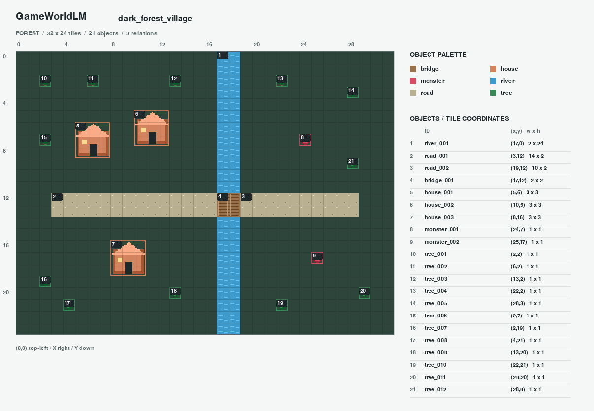
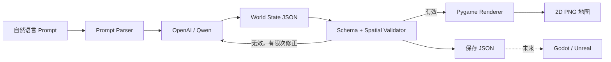

# GameWorldLM v0.3

GameWorldLM 将自然语言场景转换为 **Spatial Token / World State JSON**，再渲染为可检查的 2D 地图。第一阶段使用现有 OpenAI 或 Qwen API，不训练模型，也不让模型生成可执行游戏代码。

v0.3 新增可恢复的自动数据生成流水线：离线构造 **10,000 条不重复 prompt**，覆盖 forest、desert、ice、city、dungeon、fantasy、cyberpunk；使用 Qwen 执行生成、校验、渲染。成功样本写入 `dataset/train.jsonl`，失败样本写入 `dataset/failed.jsonl`，统计保存到 `dataset/report.json`。World State schema 与原有测试保持不变。

```bash
# 无需 API Key，生成完整 prompt 清单。
python -m dataset_generation.dataset_builder --prepare-only
# 使用 .env 中的 Qwen 配置，先处理七条，覆盖全部主题。
python -m dataset_generation.dataset_builder --limit 7
# 恢复同一批次，跳过已完成的成功和失败样本。
python -m dataset_generation.dataset_builder
```

`--limit` 限制本次新增样本数；总清单仍为 10,000 条。完整运行会产生真实 API 费用，默认串行、每分钟最多启动 20 次逻辑请求、每个场景最多三次生成/修正。运行期间创建 `dataset/STOP` 文件会在当前样本结束后暂停；移除后重新运行即可继续。详见 [v0.3 数据流水线](docs/dataset_generation.md)。

v0.2 新增真实生成记录、十场景 Qwen 测试入口和 LoRA 数据集导出，保持原有 World State schema 不变。完整说明见 [数据记录与训练格式](docs/dataset_format.md)。

已完成真实 Qwen 调用：首轮十场景批测通过 6/10，改进反馈并补测后十类场景均有有效地图。累计记录 16 个 run，最终导出 10 条有效训练样本；详见 [真实调用测试报告](docs/real_generation_report.md)。

```bash
python -m pip install -e ".[dev]"
# 在 .env 中配置 QWEN_API_KEY 后，先测试一个场景，再运行十场景套件。
python -m examples.real_generation --provider qwen --limit 1
python -m examples.real_generation --provider qwen
```

每个真实生成任务保存到 `outputs/real/runs/<run_id>/`，包含 prompt、模型与用量记录、每次尝试的原始响应和校验报告，以及通过校验后的 `world.json` 与 `map.png`。每批结束自动导出 messages 和 Alpaca JSONL；失败项与 fixture 不进入训练集。重复运行不会覆盖历史数据。



> 上图及 `docs/previews/` 中的地图来自明确标记的手工 fixture，用于离线回归测试，不代表真实 LLM 输出质量。配置 API Key 后可用相同流程生成模型结果。

## 架构



```text
GameWorldLM/
  gameworldlm/       CLI 与输出流程
  llm/
    prompt_parser.py 提示词构造和修正反馈
    providers.py     OpenAI / Qwen 接口
    fixture_backend.py 明确标记的离线测试替身
  world/
    schema.py        Pydantic Spatial Token 和版本化 JSON Schema
    geometry.py      网格几何运算
    generator.py     生成、校验、有限次修正
    validator.py     空间约束
    io.py            JSON 读写
  engine/
    pygame_renderer.py 无窗口 PNG 渲染
    godot_export.py  后续引擎适配接口，尚未实现 Godot 导出
  assets/
    catalog.py       类型颜色、地形背景和占位图形
    placeholder/     可替换的原创 PNG 素材
  examples/
    prompts.json     五个中文场景及对象数量期望
    scenarios.py    手工构造的固定测试世界
    real_prompts.json 十个真实调用测试 prompt
    real_generation.py 真实 API 批量生成入口
  dataset/           逐次记录、质量过滤和 LoRA 数据导出
  dataset_generation/
    prompt_generator.py 均衡、多样、可复现的场景 prompt 清单
    qwen_generator.py Qwen 调用适配及逐次请求限速
    dataset_builder.py 生成、校验、渲染与训练数据汇总
    storage.py       SQLite 检查点和可恢复 JSONL 输出
  tests/             单元和端到端离线测试
  docs/previews/     五组可直接查看的 JSON / PNG
  .github/workflows/ci.yml
```

## 环境和安装

使用 Python **3.10 至 3.13**。渲染直接创建 pygame Surface，不需要桌面、GPU、音频设备或 X Server。

```bash
python -m venv .venv
# Linux / macOS
source .venv/bin/activate
# Windows PowerShell
# .\.venv\Scripts\Activate.ps1
python -m pip install -e ".[dev]"
```

也可用 `uv venv --python 3.12`，然后执行 `uv pip install -e ".[dev]"`。

## 先运行离线回归场景

```bash
gameworldlm examples --provider fixture --output-dir outputs/offline
pytest -q
ruff check .
```

若 Windows 的系统临时目录存在权限限制，可在离线生成后使用 `pytest -q --basetemp outputs/pytest-run`，将测试临时文件放在项目内。

一次输出森林村庄、冰雪城堡、沙漠遗迹、末日城市、魔法学院的 JSON 和 PNG，以及记录数据来源、对象数量检查和失败原因的 `manifest.json`。命令在任何场景失败或指定对象数量不符时返回非零退出码。

`fixture` 只接受 `examples/prompts.json` 中的五个完整提示词。它是测试数据回放，不支持任意自然语言，也不会在 API 调用失败时自动代替模型。

## 接入 OpenAI / Qwen

将 `.env.example` 复制为 `.env`，填写对应 Key。`.env` 和运行输出已加入 `.gitignore`，请勿提交密钥。环境变量优先于 `.env`。

OpenAI：

```dotenv
GAMEWORLDLM_PROVIDER=openai
OPENAI_API_KEY=your_key_here
OPENAI_MODEL=gpt-4o-mini
OPENAI_BASE_URL=https://api.openai.com/v1
```

Qwen：

```dotenv
GAMEWORLDLM_PROVIDER=qwen
QWEN_API_KEY=your_key_here
QWEN_MODEL=qwen-plus
QWEN_BASE_URL=https://dashscope.aliyuncs.com/compatible-mode/v1
```

Qwen 也识别 `DASHSCOPE_API_KEY`。Key 与接口地域必须匹配；国际站可按账号文档设置 `QWEN_BASE_URL`。模型名可由环境变量或 `--model` 更换。

```bash
gameworldlm generate --provider openai --prompt "一个黑暗森林中的魔法村庄，有3个木屋、一条河流和两个怪物" --output-dir outputs/my_world
gameworldlm examples --provider qwen --output-dir outputs/qwen
```

单场景输出 `world.json`、`map.png`、`generation.json`；后者记录提示词、provider、model 和生成次数。敏感场景描述也可能出现在这些输出中。

可用 `--prompt-file prompt.txt` 读取 UTF-8 文本，使用 `--attempts 1` 关闭校验修正，或设置 `LLM_TIMEOUT_SECONDS` / `LLM_MAX_TOKENS` 控制超时和输出上限。全局参数 `--env-file path/to/.env` 写在子命令之前。

OpenAI 使用 [Structured Outputs](https://developers.openai.com/api/docs/guides/structured-outputs) 的严格 JSON Schema；Qwen 使用兼容接口的 `json_object` 模式，并由本地 Pydantic 和空间校验补足约束。所选模型必须支持相应输出模式。SDK 最多重试一次临时网络错误，生成器默认最多进行三次完整生成或修正；调用可能产生接口费用。认证、拒绝、截断等错误会明确返回，不会当作成功地图。

自动测试使用离线场景及模拟 HTTP 响应，不消耗 API 配额。v0.2 的真实 Qwen 验证通过 `python -m examples.real_generation` 独立执行，其结果保存在带时间和 request ID 的运行记录中；旧的 `gameworldlm examples` 命令继续保留五场景回归行为。

## Spatial Token

```json
{
  "schema_version": "1.0",
  "scene": "forest_house",
  "map": {"width": 32, "height": 24, "biome": "forest"},
  "objects": [
    {
      "object_type": "house",
      "id": "house_001",
      "position": [10, 20],
      "attributes": {"size": [3, 3], "style": "wood", "material": null, "tags": []}
    },
    {
      "object_type": "npc",
      "id": "npc_001",
      "position": [14, 21],
      "attributes": {"size": [1, 1], "style": null, "material": null, "tags": []}
    }
  ],
  "relations": [{"relation_type": "near", "source": "npc_001", "target": "house_001"}]
}
```

`object_type` / `attributes` 是规范字段名，分别对应初始概念示例中的 `type` / `properties`。额外字段不接受，避免模型悄悄改变数据契约。`attributes` 是有类型的可扩展结构；需要新属性时修改 schema 并考虑版本升级。

- 坐标原点为左上角，x 向右、y 向下；位置及占地尺寸均以整数格子计。对象位置是占地左上角，边界右端、下端不包含在占地区间内。
- 地图尺寸为 8 到 128 格；对象 1 到 256 个；ID 必须唯一并符合 ASCII snake_case。`size` 默认 `[1,1]`，其余可省略字段由模型补齐。导出的 JSON 包含默认值。
- `near`：两个占地区域最近格子的切比雪夫距离不超过 3；重叠为 0，相邻为 1。
- `inside`：source 的整个占地包含在 target 内，且二者占地不能完全相同。
- `connected_to`：占地边界共用长度大于 0 的一条边；重叠及仅对角接触不算连接。
- `near` 与 `connected_to` 对称，反向重复也无效；自引用和不存在的 ID 无效。
- 地面层：`river/road/dune/courtyard`；实体层：`monster/npc/vehicle`；其他类型属于结构层。同层重叠需要直接、有效的 `inside` 关系。实体不能穿入结构，桥梁及显式包含关系除外。地面允许承载上层对象。

空间校验目前不是物理或可通行性引擎：不会推导道路是否全局连通、河流形状、实体是否能游泳，或完整理解任意提示词。五场景批量检查会额外验证指定对象数量；一般提示词的语义遵循仍由模型负责。

## 单独使用模块

```python
from llm.providers import OpenAICompatibleBackend, ProviderConfig
from world.generator import WorldGenerator
from world.io import save_world
from engine.pygame_renderer import PygameRenderer

# 直接使用 Python API 时请自行 load_dotenv() 或设置环境变量。
backend = OpenAICompatibleBackend(ProviderConfig.from_env("qwen"))
try:
    result = WorldGenerator(backend).generate("一座冰雪城堡，有两座塔和两个守卫")
    save_world(result.world, "outputs/world.json")
    PygameRenderer(tile_size=24).render(result.world, "outputs/map.png")
finally:
    backend.close()
```

```bash
gameworldlm validate outputs/world.json
gameworldlm render outputs/world.json --output outputs/rerender.png
gameworldlm schema --output outputs/world.schema.json
gameworldlm assets --output-dir assets/placeholder
```

图中颜色区分对象类型，编号对应右侧 ID 和 `(x,y)` 坐标、占地尺寸。`--tile-size` 支持 16 至 48 像素。关系保留在 JSON 中并参与校验，目前不绘制连线。PNG 的主题、图形和文字使用可复现的本地素材。

## 模块设计理由

| 模块 | 设计理由 |
| --- | --- |
| `world/schema.py` | 同一数据契约用于提示词、API 输出、验证、保存和后续引擎，防止格式漂移。Spatial Token 是结构化数据单元，不是新增模型词表或 tokenizer。 |
| `world/validator.py` | JSON Schema 不能表达 ID 引用、矩形包含等跨对象约束，单独建立空间验证层。 |
| `llm/` | provider 与提示词分离，OpenAI/Qwen 共享接口，未来本地模型只需实现 `complete(messages)`。 |
| `world/generator.py` | 修正循环放在领域流程中，任何 provider 都接受相同验证；次数有界，避免无限调用。 |
| `engine/pygame_renderer.py` | pygame 只消费有效 World State，可脱离模型重复渲染，服务器也能直接保存图片。 |
| `assets/` | 样式与世界语义分离，替换图像不影响坐标、关系和生成逻辑。 |
| `examples/`、`tests/` | 固定场景验证确定性流程，模拟 HTTP 验证接口契约；在线评估另行记录模型质量。 |
| `engine/godot_export.py` | 预留导出接口但明确抛出未实现错误，避免把占位文件误认为已实现引擎。 |

## 后续扩展

1. **LLM Agent**：将需求解析、布局、验证、修复拆成工具调用，支持局部编辑和约束反馈。
2. **World Model**：增加状态变化、事件、时间序列、世界预测及保存回放；有数据与评估后再讨论训练。
3. **本地模型**：新增 backend，或使用支持 JSON 输出的 OpenAI-compatible 本地服务；当前 MVP 只提供 OpenAI/Qwen 配置入口。
4. **Godot**：把验证后的对象和关系转换为 TileMap / Node2D 场景，绑定可通行性、碰撞及交互。
5. **Unreal Engine**：增加独立的 Paper2D / Actor 导出器，共享 World State，不耦合 LLM 生成逻辑。
6. **空间规划**：加入多边形地形、导航网格、道路连通约束、语义指标以及大地图分块生成。

CI 在 Python 3.10 和 3.12 上运行无凭据测试及五场景离线生成，并上传地图产物。
