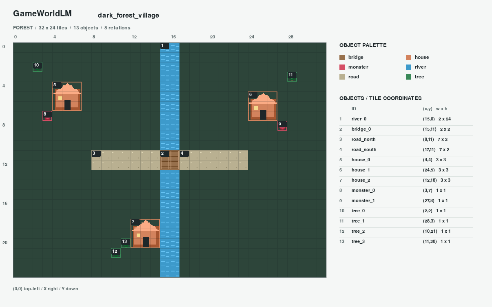

# Qwen v0.2 Real Generation Report

测试日期：2026-09-23（Asia/Shanghai）。Provider：Qwen；请求模型和接口返回模型均为
`qwen-plus`；使用中国内地兼容接口、非思考模式。此次结果来自真实付费 API 响应，
不是 fixture 或 HTTP mock。原有 World State schema、空间 validator 和 pygame renderer
均保持不变。

## 结果

- 首轮十场景批测：**6/10 通过**，每个场景最多 3 次生成或修正。
- 改进空间反馈并补测后：**十类场景均有一个有效 JSON + PNG**。
- 全部调试与补测累计：16 个 run，10 个成功，6 个失败；40 次 SDK 调用，返回的
  `usage.total_tokens` 累计 167,283。SDK 内部 HTTP 重试不单独计为一个 attempt。
- 所有失败记录保留，未手工修改模型生成的世界，也未放宽 validator。
- 最终数据集接受 10 条记录，排除 6 条失败记录；按 prompt 分组划分为训练 8 条、验证 2 条。
- 本地自动测试 77 项通过；十张 PNG 均通过文件解码和地图区域非空像素检查。

调试中改进了系统提示和修正反馈，因此“十类场景都有有效样本”不是固定配置下
100% 的一次生成成功率。每次实际请求的完整消息都保存在该 attempt 的 `request.json`。

## 场景明细

| 场景 | 首轮批测 | 最终有效 run 的尝试次数 | 最终有效 run_id |
| --- | --- | --- | --- |
| 森林村庄 | 通过 | 3 | `20260923T150127127256Z_9abea8f5fc93` |
| 冰雪城堡 | 通过 | 2 | `20260923T150253451563Z_59fbf1cee4b4` |
| 沙漠遗迹 | 通过 | 2 | `20260923T150330469587Z_d975627ea2d3` |
| 末日城市 | 通过 | 3 | `20260923T150402001587Z_3ac9016a8875` |
| 魔法学院 | 通过 | 1 | `20260923T150528390024Z_58b4242714e0` |
| 小型森林营地 | 通过 | 3 | `20260923T150549846829Z_088d9b27d3f9` |
| 森林哨所 | 未通过 | 2 | `20260923T151056157180Z_4ec1b015dc49` |
| 冰原前哨 | 未通过 | 2 | `20260923T151611434173Z_9e9753ce7586` |
| 奥术圣所 | 未通过 | 1 | `20260923T151343394664Z_0a55e9f5726c` |
| 沙漠商队 | 未通过 | 1 | `20260923T151411201375Z_8cfe0610f8c9` |

## 产物位置

完整原始数据保存在工作区的 `outputs/real/`，不随 Git 提交：

- `runs/<run_id>/`：prompt、模型记录、每次原始响应、校验报告和最终地图。
- `batches/20260923T150127123256Z_22eb5294cc13.json`：首轮 6/10 的批测记录。
- `datasets/v0.2-verified/`：最终 messages / Alpaca JSONL、LoRA 字段映射和排除清单。
- `contact_sheet.png`：十张真实生成地图的预览总览。

公开仓库仅包含一份没有凭据的真实生成示例：
[World JSON](real_previews/forest_village.json) / [PNG](real_previews/forest_village.png)。

## 暴露的问题

模型最常见的错误是把对角接触或重叠当成 `connected_to`，生成结构重叠，或为不需要
连接的对象添加无效关系。修正反馈现在提供计算后的矩形边界，并在显式测试要求没有
对应关系约束时指出可移除的无效可选关系。实际修改仍由模型完成。

通过校验的样本保证当前 schema、空间规则和显式测试 expectations 成立，不代表完整
自然语言语义、游戏可玩性或艺术质量已经自动验证。训练数据带有
`automatically_validated_not_human_reviewed` 标记。
